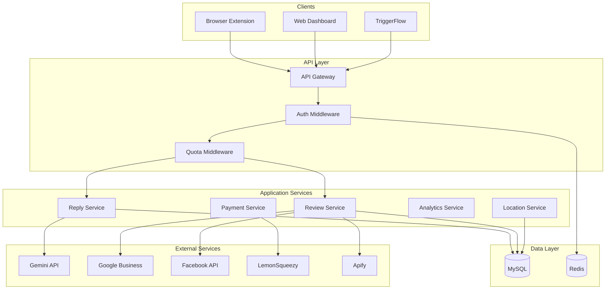

# Architecture Document: ReplyStack

**Document Version:** 1.0
**Date:** 2026-01-23
**PRD Reference:** docs/prd-replystack-2026-01-23.md
**Project Level:** 2 (Medium - 5-15 stories)
**Status:** Approved (Documentation de l'existant + évolutions)

---

## 1. Introduction

### 1.1 Purpose

Ce document décrit l'architecture système de ReplyStack, une plateforme de réponse aux avis clients alimentée par l'IA. Il documente l'architecture **existante** et identifie les **évolutions nécessaires** pour satisfaire les requirements du PRD.

### 1.2 Scope

- Extension navigateur Chrome/Firefox
- Dashboard web SaaS
- API backend
- Intégrations externes (Google Business, Facebook, Apify, LemonSqueezy)

### 1.3 Document Structure

1. Architectural Drivers
2. High-Level Architecture
3. Technology Stack
4. System Components
5. Data Architecture
6. API Design
7. NFR Coverage
8. Security Architecture
9. Scalability & Performance
10. Reliability & Availability
11. Development & Deployment
12. Traceability & Trade-offs

---

## 2. Architectural Drivers

Les drivers architecturaux sont les requirements qui influencent le plus les décisions de design.

### 2.1 Drivers Critiques

| ID | Driver | Requirement | Solution Architecturale |
|----|--------|-------------|------------------------|
| **AD-001** | Performance IA | Génération < 5s (P95) | Gemini 2.0 Flash (rapide), cache prompts, timeouts 15s |
| **AD-002** | Performance Dashboard | Chargement < 3s | Cursor pagination, React Query cache, CDN assets |
| **AD-003** | Sécurité Tokens | Protection OAuth | Chiffrement AES-256, rotation tokens |
| **AD-004** | Disponibilité | 99.5% uptime | Railway managed, health checks, graceful degradation |
| **AD-005** | Scalabilité | 1000 users concurrents | API stateless, Redis sessions, Horizon workers |
| **AD-006** | Multi-plateforme | 4+ plateformes d'avis | Content scripts adaptables, factory pattern |

### 2.2 Contraintes Business

- **Budget limité** : Solutions économiques privilégiées (Gemini gratuit, Railway)
- **Équipe réduite** : 1-2 développeurs, architecture simple à maintenir
- **Time-to-market** : MVP rapide, itérations fréquentes

---

## 3. High-Level Architecture

### 3.1 Pattern Architectural

**Pattern :** Modular Monolith avec Extension Browser

**Rationale :**
- Projet Level 2 (5-15 stories) → Monolith approprié
- Équipe réduite → Moins de complexité opérationnelle
- Extension découplée → Frontière naturelle entre web et extension
- Évolution possible vers microservices si nécessaire

### 3.2 Architecture Overview

```
┌─────────────────────────────────────────────────────────────────────┐
│                           CLIENTS                                    │
├─────────────────────┬─────────────────────┬─────────────────────────┤
│   Browser Extension │     Web Dashboard   │     TriggerFlow API     │
│   (Plasmo/React)    │   (React 19/Vite)   │    (External Client)    │
└─────────┬───────────┴──────────┬──────────┴────────────┬────────────┘
          │                      │                        │
          │    HTTPS/REST        │    HTTPS/REST          │ HTTPS/REST
          │                      │                        │
┌─────────▼──────────────────────▼────────────────────────▼───────────┐
│                         API GATEWAY                                  │
│                    (Laravel 12 + Sanctum)                           │
│  ┌─────────────┐  ┌─────────────┐  ┌─────────────┐  ┌─────────────┐ │
│  │    Auth     │  │    Rate     │  │   Quota     │  │   CORS      │ │
│  │ Middleware  │  │  Limiting   │  │  Checking   │  │  Handling   │ │
│  └─────────────┘  └─────────────┘  └─────────────┘  └─────────────┘ │
└─────────────────────────────┬───────────────────────────────────────┘
                              │
┌─────────────────────────────▼───────────────────────────────────────┐
│                      APPLICATION CORE                                │
│  ┌───────────────┐  ┌───────────────┐  ┌───────────────┐            │
│  │ Reply Service │  │ Review Service│  │ Location Svc  │            │
│  │ (AI Generation│  │ (CRUD, Sync)  │  │ (Management)  │            │
│  └───────────────┘  └───────────────┘  └───────────────┘            │
│  ┌───────────────┐  ┌───────────────┐  ┌───────────────┐            │
│  │ Quota Service │  │ Analytics Svc │  │ Payment Svc   │            │
│  │ (Usage Track) │  │ (Stats, Sent.)│  │ (LemonSqueezy)│            │
│  └───────────────┘  └───────────────┘  └───────────────┘            │
└─────────────────────────────┬───────────────────────────────────────┘
                              │
┌─────────────────────────────▼───────────────────────────────────────┐
│                      DATA LAYER                                      │
│  ┌───────────────┐  ┌───────────────┐  ┌───────────────┐            │
│  │   Eloquent    │  │    Redis      │  │   Job Queue   │            │
│  │   ORM/MySQL   │  │ (Cache/Queue) │  │   (Horizon)   │            │
│  └───────────────┘  └───────────────┘  └───────────────┘            │
└─────────────────────────────┬───────────────────────────────────────┘
                              │
┌─────────────────────────────▼───────────────────────────────────────┐
│                    EXTERNAL INTEGRATIONS                             │
│  ┌───────────────┐  ┌───────────────┐  ┌───────────────┐            │
│  │  Gemini API   │  │ Google Biz API│  │  LemonSqueezy │            │
│  │  (AI Gen)     │  │  (OAuth/Sync) │  │  (Payments)   │            │
│  └───────────────┘  └───────────────┘  └───────────────┘            │
│  ┌───────────────┐  ┌───────────────┐  ┌───────────────┐            │
│  │ Facebook API  │  │  Apify        │  │  Mistral API  │            │
│  │ (OAuth/Sync)  │  │  (Scraping)   │  │  (AI Fallback)│            │
│  └───────────────┘  └───────────────┘  └───────────────┘            │
└─────────────────────────────────────────────────────────────────────┘
```

### 3.3 Component Interaction Flow

**Flow principal : Génération de réponse**

```
1. User (Extension) → Click "Generate Reply"
2. Extension → POST /api/replies/generate (with review data)
3. API Gateway → Auth (Sanctum) → Quota Check
4. ReplyGeneratorService → AIProviderFactory → GeminiService
5. GeminiService → Gemini API → Response
6. QuotaService → Decrement quota
7. Response saved to DB
8. API → Extension → Display reply
```

---

## 4. Technology Stack

### 4.1 Frontend - Web Dashboard

| Category | Technology | Version | Rationale |
|----------|------------|---------|-----------|
| **Framework** | React | 19.2.0 | Réutilisation avec extension, écosystème mature |
| **Build Tool** | Vite | 6.2.0 | Fast HMR, ESM native, optimal pour React |
| **State Management** | React Query | 5.64.0 | Server state, cache automatique, cursor pagination |
| **Routing** | React Router | 7.2.0 | Standard React, nested routes |
| **Styling** | Tailwind CSS | 3.4.17 | Utility-first, rapid prototyping |
| **Icons** | Lucide React | 0.562.0 | Léger, tree-shakeable |
| **i18n** | i18next | - | Multi-langue FR/EN |
| **HTTP Client** | Axios | 1.7.0 | Interceptors, error handling |

**Trade-offs :**
- ✓ React Query vs Redux : Meilleur pour server state, moins de boilerplate
- ✓ Tailwind vs CSS Modules : Plus rapide à développer, moins de fichiers
- ✗ Pas de SSR (Vite SPA) : SEO limité, mais acceptable pour dashboard

### 4.2 Frontend - Browser Extension

| Category | Technology | Version | Rationale |
|----------|------------|---------|-----------|
| **Framework** | Plasmo | 0.90.5 | Build multi-browser, DX moderne, React support |
| **UI** | React | 19.0.0 | Consistance avec web app |
| **Storage** | chrome.storage | - | Persistance tokens cross-session |
| **Messaging** | Chrome Runtime | MV3 | Communication popup ↔ content scripts |

**Trade-offs :**
- ✓ Plasmo vs WXT : Meilleur support React, documentation plus complète
- ✗ Manifest V3 : Limitations service worker, mais requis par Chrome

### 4.3 Backend

| Category | Technology | Version | Rationale |
|----------|------------|---------|-----------|
| **Framework** | Laravel | 12.x | Expertise équipe, écosystème complet |
| **Auth** | Sanctum | - | Tokens API stateless, simple setup |
| **Queue** | Horizon | - | Dashboard monitoring, Redis driver |
| **Cache** | Redis | - | Sessions, cache, queues unifié |
| **ORM** | Eloquent | - | Productivité, relations élégantes |

**Trade-offs :**
- ✓ Laravel vs Node.js : Expertise existante, batteries included
- ✓ Sanctum vs Passport : Plus simple pour API tokens, pas besoin OAuth complet

### 4.4 Database

| Category | Technology | Version | Rationale |
|----------|------------|---------|-----------|
| **Primary DB** | MySQL | 8.x | Expertise existante, ACID compliant |
| **Cache/Queue** | Redis | - | Fast in-memory, pub/sub support |

**Trade-offs :**
- ✓ MySQL vs PostgreSQL : Expertise existante, performance suffisante
- ✗ Pas de NoSQL : Données relationnelles, schéma stable

### 4.5 AI Providers

| Provider | Model | Usage | Cost |
|----------|-------|-------|------|
| **Gemini** | 2.0 Flash | Default (tous plans) | Quasi-gratuit |
| **Mistral** | Large | Paid plans (option) | Payant |
| **Claude** | Haiku | Backup (non actif) | - |

**Pattern :** Factory avec interface commune (`AIProviderContract`)

### 4.6 Infrastructure

| Category | Technology | Rationale |
|----------|------------|-----------|
| **Hosting** | Railway | Simple, auto-scaling, managed services |
| **CDN** | Railway (ou Cloudflare) | Assets statiques |
| **DNS** | Cloudflare | DDoS protection, SSL |
| **Monitoring** | Railway Metrics | Inclus, suffisant pour MVP |

### 4.7 Third-Party Services

| Service | Purpose | Integration |
|---------|---------|-------------|
| **LemonSqueezy** | Payments | Checkout hosted, webhooks |
| **Google Business API** | Review sync/publish | OAuth 2.0 |
| **Facebook Graph API** | Review sync/publish | OAuth 2.0 |
| **Apify** | Web scraping | Webhooks, actor runs |

---

## 5. System Components

### 5.1 Component Overview

```
┌─────────────────────────────────────────────────────────────────┐
│                    BROWSER EXTENSION                             │
│  ┌──────────────┐  ┌──────────────┐  ┌──────────────┐           │
│  │   Popup UI   │  │Content Scripts│  │  Background  │           │
│  │  (React)     │  │(Per-Platform) │  │  (Service)   │           │
│  └──────────────┘  └──────────────┘  └──────────────┘           │
└─────────────────────────────────────────────────────────────────┘

┌─────────────────────────────────────────────────────────────────┐
│                      WEB DASHBOARD                               │
│  ┌──────────────┐  ┌──────────────┐  ┌──────────────┐           │
│  │    Pages     │  │  Components  │  │   Services   │           │
│  │ (Routes)     │  │  (UI)        │  │  (API calls) │           │
│  └──────────────┘  └──────────────┘  └──────────────┘           │
└─────────────────────────────────────────────────────────────────┘

┌─────────────────────────────────────────────────────────────────┐
│                      LARAVEL API                                 │
│  ┌──────────────┐  ┌──────────────┐  ┌──────────────┐           │
│  │ Controllers  │  │  Services    │  │    Models    │           │
│  │ (HTTP)       │  │ (Business)   │  │  (Data)      │           │
│  └──────────────┘  └──────────────┘  └──────────────┘           │
│  ┌──────────────┐  ┌──────────────┐  ┌──────────────┐           │
│  │  Middleware  │  │    Jobs      │  │   Events     │           │
│  │ (Pipeline)   │  │ (Async)      │  │  (Hooks)     │           │
│  └──────────────┘  └──────────────┘  └──────────────┘           │
└─────────────────────────────────────────────────────────────────┘
```

### 5.2 Component Details

#### Component: Browser Extension

**Purpose:** Génération de réponses IA directement sur les plateformes d'avis

**Responsibilities:**
- Injection de boutons sur les pages d'avis
- Extraction des données d'avis (auteur, note, contenu)
- Communication avec l'API backend
- Stockage des credentials utilisateur
- Auto-extraction programmée (plans payants)

**Interfaces:**
- chrome.runtime.sendMessage (interne)
- REST API (HTTPS vers backend)

**Dependencies:**
- Backend API (auth, génération)
- Chrome Storage (tokens)

**FRs Addressed:** FR-EXT-001 à FR-EXT-006

**Sub-components:**

| Sub-component | File | Purpose |
|---------------|------|---------|
| Popup | `popup/index.tsx` | UI login, quota, settings |
| Background | `background/index.ts` | Service worker, message handling |
| Google Content | `contents/google-business.ts` | Google Business adapter |
| TripAdvisor Content | `contents/tripadvisor.ts` | TripAdvisor adapter |
| Booking Content | `contents/booking.ts` | Booking adapter |
| Airbnb Content | `contents/airbnb.ts` | Airbnb adapter |

---

#### Component: Web Dashboard

**Purpose:** Interface centralisée pour gérer avis, historique, paramètres

**Responsibilities:**
- Authentification utilisateur
- Affichage historique des réponses
- Configuration établissement
- Analytics et statistiques
- Gestion abonnement

**Interfaces:**
- Browser (HTTPS, port 443)
- REST API calls (Axios)

**Dependencies:**
- Backend API (toutes opérations)
- LemonSqueezy (checkout redirect)

**FRs Addressed:** FR-DASH-001 à FR-DASH-006, FR-PAY-001 à FR-PAY-002

---

#### Component: API Backend (Laravel)

**Purpose:** Logique métier, persistance, intégrations

**Responsibilities:**
- Authentification et autorisation
- Génération de réponses IA
- Gestion des quotas
- Synchronisation des avis (API/scraping)
- Webhooks (payments, Apify)

**Interfaces:**
- REST API (HTTPS, port 443)
- Webhooks (POST endpoints)

**Dependencies:**
- MySQL (data persistence)
- Redis (cache, queues)
- Gemini API (AI generation)
- Google/Facebook APIs (OAuth, sync)
- LemonSqueezy (payments)

**FRs Addressed:** Tous les FRs backend

---

#### Component: AI Provider Factory

**Purpose:** Abstraction pour les providers IA

**Responsibilities:**
- Sélection du provider selon le plan utilisateur
- Interface commune pour tous les providers
- Fallback en cas d'erreur

**Pattern:** Factory + Strategy

```php
interface AIProviderContract {
    public function generateCompletion(string $prompt, array $options = []): array;
    public function getName(): string;
    public function supportsSystemPrompt(): bool;
}

class AIProviderFactory {
    public static function make(?string $provider = null): AIProviderContract;
    public static function forUser(User $user): AIProviderContract;
}
```

---

#### Component: Review Sync Engine

**Purpose:** Synchronisation des avis depuis sources externes

**Responsibilities:**
- Fetch via Google Business API
- Fetch via Facebook Graph API
- Traitement des résultats Apify (scraping)
- Déduplication (external_id)
- Détection de langue

**Jobs:**
- `SyncGoogleReviewsJob`
- `SyncExternalReviewsJob`
- `ProcessApifyResultsJob`

---

### 5.3 Component Diagram (Mermaid)



---

## 6. Data Architecture

### 6.1 Entity Relationship Diagram

```
┌─────────────────┐       ┌─────────────────┐       ┌─────────────────┐
│     users       │       │  organizations  │       │   locations     │
├─────────────────┤       ├─────────────────┤       ├─────────────────┤
│ id              │───┐   │ id              │───┐   │ id              │
│ email           │   │   │ name            │   │   │ user_id         │──┐
│ password        │   └──▶│ owner_id        │   └──▶│ organization_id │  │
│ name            │       │ max_locations   │       │ name            │  │
│ plan            │       │ max_users       │       │ address         │  │
│ monthly_quota   │       └─────────────────┘       │ google_place_id │  │
│ quota_used_month│                                 │ default_tone    │  │
│ organization_id │                                 │ default_language│  │
│ is_super_admin  │                                 └────────┬────────┘  │
└─────────────────┘                                          │           │
                                                             │           │
                          ┌──────────────────────────────────┘           │
                          │                                              │
                          ▼                                              │
┌─────────────────┐       ┌─────────────────┐       ┌─────────────────┐ │
│    reviews      │       │review_connections│      │    responses    │ │
├─────────────────┤       ├─────────────────┤       ├─────────────────┤ │
│ id              │◀──────│ id              │       │ id              │ │
│ location_id     │       │ location_id     │       │ review_id       │─┘
│ platform        │       │ platform        │       │ user_id         │
│ external_id     │       │ is_active       │       │ content         │
│ author_name     │       │ platform_url    │       │ tone            │
│ rating          │       │ access_token    │       │ language        │
│ content         │       │ refresh_token   │       │ is_published    │
│ language        │       │ apify_enabled   │       │ tokens_used     │
│ status          │       └─────────────────┘       │ generation_time │
│ published_at    │                                 └─────────────────┘
└─────────────────┘

┌─────────────────┐       ┌─────────────────┐
│ location_       │       │ apify_requests  │
│ response_profiles│      ├─────────────────┤
├─────────────────┤       │ id              │
│ id              │       │ run_id          │
│ location_id     │       │ actor_id        │
│ business_name   │       │ review_conn_id  │
│ business_sector │       │ status          │
│ tone            │       │ platform        │
│ length          │       │ reviews_received│
│ negative_strategy│      │ error_message   │
│ custom_instructions│    └─────────────────┘
└─────────────────┘
```

### 6.2 Key Tables

#### users
```sql
CREATE TABLE users (
    id BIGINT UNSIGNED PRIMARY KEY AUTO_INCREMENT,
    email VARCHAR(255) UNIQUE NOT NULL,
    password VARCHAR(255) NOT NULL,
    name VARCHAR(255),
    plan ENUM('free','starter','pro','business','enterprise') DEFAULT 'free',
    monthly_quota INT DEFAULT 15,
    quota_used_month INT DEFAULT 0,
    quota_reset_at TIMESTAMP,
    ai_provider VARCHAR(50) DEFAULT 'gemini',
    organization_id BIGINT UNSIGNED NULL,
    is_super_admin BOOLEAN DEFAULT FALSE,
    external_user_id VARCHAR(255) NULL,
    external_source VARCHAR(50) NULL,
    -- LemonSqueezy fields
    lemon_squeezy_customer_id VARCHAR(255),
    lemon_squeezy_subscription_id VARCHAR(255),
    created_at TIMESTAMP,
    updated_at TIMESTAMP,

    INDEX idx_email (email),
    INDEX idx_organization (organization_id),
    INDEX idx_external (external_user_id, external_source)
);
```

#### locations
```sql
CREATE TABLE locations (
    id BIGINT UNSIGNED PRIMARY KEY AUTO_INCREMENT,
    user_id BIGINT UNSIGNED NOT NULL,
    organization_id BIGINT UNSIGNED NULL,
    name VARCHAR(255) NOT NULL,
    address TEXT,
    -- Platform IDs
    google_place_id VARCHAR(255),
    tripadvisor_id VARCHAR(255),
    booking_id VARCHAR(255),
    airbnb_id VARCHAR(255),
    -- OAuth tokens (encrypted)
    google_access_token TEXT,
    google_refresh_token TEXT,
    google_token_expires_at TIMESTAMP,
    facebook_page_id VARCHAR(255),
    facebook_access_token TEXT,
    -- Settings
    default_tone VARCHAR(50) DEFAULT 'professional',
    default_language VARCHAR(5) DEFAULT 'auto',
    auto_fetch_enabled BOOLEAN DEFAULT FALSE,
    -- External mapping (TriggerFlow)
    external_facility_id VARCHAR(255),
    external_source VARCHAR(50),
    created_at TIMESTAMP,
    updated_at TIMESTAMP,

    FOREIGN KEY (user_id) REFERENCES users(id) ON DELETE CASCADE,
    INDEX idx_user (user_id),
    INDEX idx_external (external_facility_id, external_source)
);
```

#### reviews
```sql
CREATE TABLE reviews (
    id BIGINT UNSIGNED PRIMARY KEY AUTO_INCREMENT,
    location_id BIGINT UNSIGNED NOT NULL,
    review_connection_id BIGINT UNSIGNED NULL,
    platform ENUM('google','tripadvisor','booking','airbnb','yelp','facebook'),
    external_id VARCHAR(255) NOT NULL,
    author_name VARCHAR(255),
    author_avatar VARCHAR(500),
    rating TINYINT UNSIGNED,
    content TEXT,
    language VARCHAR(5),
    published_at TIMESTAMP,
    status ENUM('pending','replied','ignored') DEFAULT 'pending',
    has_response BOOLEAN DEFAULT FALSE,
    response_content TEXT,
    response_published_at TIMESTAMP,
    sync_source ENUM('api','extension','apify'),
    created_at TIMESTAMP,
    updated_at TIMESTAMP,

    UNIQUE KEY uk_platform_external (platform, external_id),
    INDEX idx_location_status (location_id, status),
    INDEX idx_location_date (location_id, published_at DESC, id DESC),
    FOREIGN KEY (location_id) REFERENCES locations(id) ON DELETE CASCADE
);
```

#### responses
```sql
CREATE TABLE responses (
    id BIGINT UNSIGNED PRIMARY KEY AUTO_INCREMENT,
    review_id BIGINT UNSIGNED NOT NULL,
    user_id BIGINT UNSIGNED NOT NULL,
    content TEXT NOT NULL,
    tone VARCHAR(50) NOT NULL,
    language VARCHAR(5) NOT NULL,
    is_published BOOLEAN DEFAULT FALSE,
    published_at TIMESTAMP NULL,
    generation_time_ms INT,
    tokens_used INT,
    ai_provider VARCHAR(50),
    created_at TIMESTAMP,
    updated_at TIMESTAMP,

    INDEX idx_review (review_id),
    INDEX idx_user_date (user_id, created_at DESC),
    FOREIGN KEY (review_id) REFERENCES reviews(id) ON DELETE CASCADE,
    FOREIGN KEY (user_id) REFERENCES users(id) ON DELETE CASCADE
);
```

### 6.3 Data Flow

```
┌──────────────┐     ┌──────────────┐     ┌──────────────┐
│   Extension  │────▶│   API        │────▶│   Database   │
│   (Extract)  │     │   (Process)  │     │   (Store)    │
└──────────────┘     └──────────────┘     └──────────────┘
       │                    │                    │
       │    Review Data     │   Normalized       │
       │    (raw JSON)      │   (Eloquent)       │
       │                    │                    │
       ▼                    ▼                    ▼
┌──────────────┐     ┌──────────────┐     ┌──────────────┐
│   Platform   │     │   Gemini     │     │    Redis     │
│   (Source)   │     │   (AI Gen)   │     │   (Cache)    │
└──────────────┘     └──────────────┘     └──────────────┘
```

**Write Path:**
1. Extension extrait review → POST /api/reviews/sync
2. API valide, déduplique (external_id) → INSERT/UPDATE
3. Response générée → INSERT responses
4. Quota décrémenté → UPDATE users

**Read Path:**
1. Dashboard GET /api/reviews → Query avec cursor
2. Eager load relations → WITH location, responses
3. Cache React Query (5 min stale time)

---

## 7. API Design

### 7.1 API Architecture

| Aspect | Choice | Rationale |
|--------|--------|-----------|
| **Style** | REST | Simple, well-understood, sufficient for CRUD |
| **Format** | JSON | Standard, lightweight, easy parsing |
| **Versioning** | URL prefix (/api/v1/) | Clear, explicit (not yet implemented, using /api/) |
| **Auth** | Bearer Token (Sanctum) | Stateless, secure for SPAs and extensions |
| **Pagination** | Cursor-based | Better performance on large datasets |

### 7.2 Authentication

**Flow:**
```
1. POST /api/auth/login
   Body: { email, password }
   Response: { token, user }

2. Subsequent requests:
   Header: Authorization: Bearer {token}

3. Token validation:
   Sanctum middleware validates token
   Returns 401 if invalid/expired
```

**Magic Token (Cross-platform):**
```
1. Extension: POST /api/auth/magic-token
   Response: { magic_token, expires_at }

2. Web: GET /api/auth/magic-token/{token}
   Response: { token, user } (if valid)
   Redirects to dashboard (authenticated)
```

### 7.3 Key Endpoints

#### Authentication
```
POST   /api/auth/register          Create account
POST   /api/auth/login             Login (returns token)
POST   /api/auth/logout            Revoke token
GET    /api/auth/user              Current user + quota
POST   /api/auth/magic-token       Generate magic token
GET    /api/auth/magic-token/{t}   Validate magic token
```

#### Reply Generation
```
POST   /api/replies/generate       Generate AI reply
       Headers: Authorization: Bearer {token}
       Body: {
           review_content: string,
           review_rating: int,
           review_author: string,
           platform: string,
           tone?: string,
           language?: string,
           location_id?: int
       }
       Response: {
           reply: string,
           tone: string,
           language: string,
           tokens_used: int,
           generation_time_ms: int,
           quota_remaining: int
       }
       Middleware: auth:sanctum, quota

GET    /api/replies                List history (cursor)
GET    /api/replies/{id}           Get single reply
```

#### Reviews
```
GET    /api/reviews                List reviews (cursor, filters)
       Query: ?location_id=&platform=&status=&cursor=
GET    /api/reviews/stats          Statistics
GET    /api/reviews/summary        AI summary
POST   /api/reviews/sync           Sync from extension
GET    /api/reviews/{id}           Single review
PATCH  /api/reviews/{id}/status    Update status
POST   /api/reviews/{id}/publish   Publish reply (API platforms)
```

#### Locations
```
GET    /api/locations              List locations
POST   /api/locations              Create location
GET    /api/locations/{id}         Get location
PATCH  /api/locations/{id}         Update location
DELETE /api/locations/{id}         Delete location
GET    /api/locations/{id}/connections    Platform connections
POST   /api/locations/{id}/response-profile    Save AI profile
```

#### Payments
```
POST   /api/lemonsqueezy/checkout  Create checkout URL
POST   /api/lemonsqueezy/portal    Customer portal URL
POST   /api/lemonsqueezy/webhook   Webhook (subscription events)
```

#### OAuth
```
GET    /api/oauth/google/{location}     Initiate Google OAuth
GET    /api/oauth/google/callback       OAuth callback
DELETE /api/oauth/google/{location}     Disconnect
GET    /api/oauth/facebook/{location}   Initiate Facebook OAuth
GET    /api/oauth/facebook/callback     OAuth callback
DELETE /api/oauth/facebook/{location}   Disconnect
```

### 7.4 Error Responses

```json
// 400 Bad Request
{
    "message": "Validation failed",
    "errors": {
        "email": ["The email field is required."]
    }
}

// 401 Unauthorized
{
    "message": "Unauthenticated."
}

// 403 Forbidden
{
    "message": "You do not have permission to access this resource."
}

// 429 Too Many Requests (Quota exceeded)
{
    "message": "Monthly quota exceeded",
    "quota_limit": 15,
    "quota_used": 15,
    "quota_reset_at": "2026-02-01T00:00:00Z",
    "upgrade_url": "https://www.reply-stack.app/pricing"
}
```

### 7.5 Rate Limiting

| Endpoint Group | Limit | Window |
|----------------|-------|--------|
| General API | 60 requests | per minute |
| Auth endpoints | 5 attempts | per minute |
| Reply generation | 20 requests | per minute |
| Webhooks | 100 requests | per minute |

---

## 8. NFR Coverage

### NFR-PERF-001: Temps de génération < 5s

**Requirement:** La génération d'une réponse doit prendre moins de 5 secondes dans 95% des cas.

**Architecture Solution:**
- **Provider IA rapide** : Gemini 2.0 Flash (latence ~1-2s)
- **Timeout configuration** : 15s max avec retry
- **Prompt optimisé** : Instructions concises, pas de tokens inutiles
- **Connection pooling** : HTTP client réutilisé

**Implementation:**
```php
// config/services.php
'gemini' => [
    'timeout' => 15,
    'connect_timeout' => 5,
],

// ReplyGeneratorService.php
$startTime = microtime(true);
$result = $this->aiProvider->generateCompletion($prompt);
$generationTime = (microtime(true) - $startTime) * 1000;
// Stored in response.generation_time_ms
```

**Validation:**
- Monitor `generation_time_ms` in production
- Alert if P95 > 5000ms
- Dashboard metric tracking

---

### NFR-PERF-002: Dashboard < 3s

**Requirement:** Les pages du dashboard doivent se charger en moins de 3 secondes.

**Architecture Solution:**
- **Cursor pagination** : Pas d'OFFSET, performance constante
- **React Query cache** : 5 min stale time, background refetch
- **Eager loading** : `Review::with('location', 'responses')`
- **Indexes** : Composite indexes sur queries fréquentes
- **CDN** : Assets statiques (JS, CSS, images)

**Implementation:**
```php
// ReviewController.php
Review::with(['location', 'latestResponse'])
    ->where('location_id', $locationId)
    ->orderBy('published_at', 'desc')
    ->cursorPaginate(20);

// Index sur reviews
INDEX idx_location_date (location_id, published_at DESC, id DESC)
```

**Validation:**
- Lighthouse performance score > 90
- First Contentful Paint < 1.5s
- Monitor with Railway metrics

---

### NFR-SEC-001: Protection des données

**Requirement:** Les données sensibles doivent être protégées.

**Architecture Solution:**
- **Tokens OAuth chiffrés** : AES-256 via Laravel encrypted cast
- **Passwords hashés** : bcrypt avec 12 rounds
- **HTTPS obligatoire** : Railway auto-SSL
- **Rate limiting** : Prévention brute force

**Implementation:**
```php
// Location.php
protected $casts = [
    'google_access_token' => 'encrypted',
    'google_refresh_token' => 'encrypted',
    'facebook_access_token' => 'encrypted',
];

// User.php
protected $hidden = [
    'password',
    'google_access_token',
    'lemon_squeezy_customer_id',
];
```

**Validation:**
- Security audit checklist
- OWASP Top 10 review
- Penetration testing (future)

---

### NFR-SEC-002: Authentification sécurisée

**Requirement:** L'authentification doit être sécurisée.

**Architecture Solution:**
- **Sanctum tokens** : Stateless, révocables
- **Token expiration** : Configurable (default: no expiry, revoke on logout)
- **CSRF protection** : Activé pour web routes
- **Input validation** : Form Requests Laravel

**Implementation:**
```php
// AuthController.php
$token = $user->createToken('api-token')->plainTextToken;

// Logout
$request->user()->currentAccessToken()->delete();

// Rate limiting
Route::middleware('throttle:5,1')->group(function () {
    Route::post('/auth/login', [AuthController::class, 'login']);
});
```

---

### NFR-AVAIL-001: 99.5% Uptime

**Requirement:** Le service doit être disponible 99.5% du temps.

**Architecture Solution:**
- **Railway managed** : Auto-restart, health checks
- **Health endpoint** : `/up` pour monitoring
- **Graceful degradation** : Fallback AI provider
- **Job retry** : 3 retries avec backoff

**Implementation:**
```php
// bootstrap/app.php
->withRouting(
    health: '/up',
)

// Job retry
public $tries = 3;
public $backoff = [60, 300, 900]; // 1min, 5min, 15min
```

**Validation:**
- Railway uptime monitoring
- External uptime monitor (UptimeRobot)
- Incident response procedure

---

### NFR-SCALE-001: 1000 users concurrents

**Requirement:** Le système doit supporter 1000 utilisateurs concurrents.

**Architecture Solution:**
- **API stateless** : Pas de session serveur, horizontal scaling
- **Redis sessions** : Distribué, fast access
- **Horizon workers** : Scalable job processing
- **Connection pooling** : Database connections réutilisées

**Implementation:**
```php
// config/database.php
'mysql' => [
    'pool' => [
        'min_connections' => 1,
        'max_connections' => 10,
    ],
],

// Horizon configuration
'production' => [
    'supervisor-1' => [
        'maxProcesses' => 10,
        'balanceMaxShift' => 1,
        'balanceCooldown' => 3,
    ],
],
```

**Validation:**
- Load testing (Artillery, k6)
- Monitor concurrent connections
- Auto-scaling triggers

---

### NFR-MAINT-001: Qualité du code

**Requirement:** Le code doit être maintenable et testé.

**Architecture Solution:**
- **Test coverage** : PHPUnit pour backend, Vitest pour frontend
- **Code style** : Laravel Pint (PHP), ESLint (JS)
- **Type safety** : TypeScript strict mode
- **Documentation** : OpenAPI/Swagger (à implémenter)

**Implementation:**
```bash
# Backend
./vendor/bin/pint          # Format PHP
./vendor/bin/phpunit       # Run tests

# Frontend
pnpm lint                  # ESLint
pnpm test                  # Vitest
```

**Validation:**
- Coverage report > 70% (critical paths)
- CI/CD gates on lint/test
- Code review required

---

## 9. Security Architecture

### 9.1 Authentication

| Aspect | Implementation |
|--------|----------------|
| **Method** | Bearer Token (Sanctum) |
| **Token Storage** | Database (personal_access_tokens) |
| **Token Lifetime** | No expiry (revoke on logout) |
| **Password Hashing** | bcrypt (12 rounds) |
| **MFA** | Not implemented (future) |

### 9.2 Authorization

| Aspect | Implementation |
|--------|----------------|
| **Model** | Ownership-based (user_id checks) |
| **Organization** | Scoped access via organization_id |
| **Super Admin** | is_super_admin flag for admin routes |
| **API Keys** | Per-integration (TriggerFlow) |

### 9.3 Data Protection

| Data Type | Protection |
|-----------|------------|
| **Passwords** | bcrypt hash, never stored plain |
| **OAuth Tokens** | AES-256 encryption (Laravel encrypted cast) |
| **API Tokens** | SHA-256 hash (Sanctum) |
| **PII** | Minimal collection, hidden from API responses |

### 9.4 Transport Security

- **HTTPS** : Enforced (Railway auto-SSL)
- **TLS** : 1.2+ minimum
- **HSTS** : Enabled via headers
- **CORS** : Restricted to allowed origins

### 9.5 Input Validation

```php
// Form Request example
class GenerateReplyRequest extends FormRequest
{
    public function rules(): array
    {
        return [
            'review_content' => 'required|string|max:10000',
            'review_rating' => 'required|integer|between:1,5',
            'platform' => 'required|in:google,tripadvisor,booking,airbnb',
            'tone' => 'nullable|in:professional,friendly,formal,casual',
        ];
    }
}
```

### 9.6 Security Headers

```php
// Middleware or nginx config
Content-Security-Policy: default-src 'self'
X-Frame-Options: DENY
X-Content-Type-Options: nosniff
Referrer-Policy: strict-origin-when-cross-origin
```

---

## 10. Scalability & Performance

### 10.1 Scaling Strategy

| Component | Strategy | Trigger |
|-----------|----------|---------|
| **API** | Horizontal (add instances) | CPU > 70% |
| **Workers** | Horizontal (add processes) | Queue depth > 100 |
| **Database** | Vertical first, then read replicas | Connections > 80% |
| **Redis** | Vertical (managed service) | Memory > 80% |

### 10.2 Caching Strategy

| Cache Type | TTL | Purpose |
|------------|-----|---------|
| **React Query** | 5 min | Client-side server state |
| **Redis (app)** | Varies | Quota locks, session |
| **CDN** | 1 year | Static assets (hashed) |
| **AI Provider** | None | No caching (dynamic) |

### 10.3 Database Optimization

**Indexes:**
```sql
-- Reviews: frequent queries
INDEX idx_location_status (location_id, status)
INDEX idx_location_date (location_id, published_at DESC, id DESC)
UNIQUE uk_platform_external (platform, external_id)

-- Users: auth lookups
INDEX idx_email (email)
INDEX idx_organization (organization_id)
```

**Query Optimization:**
- Cursor pagination (no OFFSET)
- Eager loading (prevent N+1)
- Select only needed columns
- Limit result sets

### 10.4 Performance Monitoring

| Metric | Tool | Alert Threshold |
|--------|------|-----------------|
| Response time | Railway | P95 > 2s |
| Error rate | Railway | > 1% |
| Queue depth | Horizon | > 100 jobs |
| Memory usage | Railway | > 80% |

---

## 11. Reliability & Availability

### 11.1 High Availability

| Aspect | Implementation |
|--------|----------------|
| **Redundancy** | Railway auto-scaling |
| **Health checks** | `/up` endpoint |
| **Failover** | Automatic (Railway) |
| **Circuit breaker** | AI provider fallback |

### 11.2 Disaster Recovery

| Metric | Target |
|--------|--------|
| **RPO** | 24 hours (daily backups) |
| **RTO** | 1 hour |
| **Backup** | Railway managed (MySQL) |
| **Restore** | Point-in-time recovery |

### 11.3 Monitoring & Alerting

**Metrics tracked:**
- API response times
- Error rates (4xx, 5xx)
- Queue job processing
- AI generation latency
- Quota usage patterns

**Alerting:**
- Railway built-in alerts
- Email notifications
- Slack integration (future)

---

## 12. Development & Deployment

### 12.1 Code Organization

```
replystack/
├── apps/
│   ├── api/              # Laravel backend
│   │   ├── app/
│   │   │   ├── Http/     # Controllers, Middleware, Requests
│   │   │   ├── Models/   # Eloquent models
│   │   │   ├── Services/ # Business logic
│   │   │   ├── Jobs/     # Queue jobs
│   │   │   └── Enums/    # Business enums
│   │   ├── database/     # Migrations, seeders
│   │   ├── routes/       # API routes
│   │   └── tests/        # PHPUnit tests
│   │
│   ├── web/              # React dashboard
│   │   └── src/
│   │       ├── pages/    # Route components
│   │       ├── components/ # Reusable UI
│   │       ├── hooks/    # Custom hooks
│   │       ├── services/ # API calls
│   │       └── contexts/ # React contexts
│   │
│   └── extension/        # Plasmo extension
│       └── src/
│           ├── background/ # Service worker
│           ├── contents/   # Platform adapters
│           ├── popup/      # Popup UI
│           └── services/   # Extension services
│
└── packages/
    └── shared/           # Shared types
```

### 12.2 Testing Strategy

| Level | Tool | Coverage Target |
|-------|------|-----------------|
| **Unit** | PHPUnit / Vitest | 70% (services) |
| **Integration** | PHPUnit Feature | Key flows |
| **E2E** | Playwright (future) | Critical paths |
| **Load** | Artillery (future) | Scalability |

### 12.3 CI/CD Pipeline

```
┌─────────┐    ┌─────────┐    ┌─────────┐    ┌─────────┐
│  Push   │───▶│  Lint   │───▶│  Test   │───▶│ Deploy  │
│         │    │  Check  │    │  Suite  │    │ Railway │
└─────────┘    └─────────┘    └─────────┘    └─────────┘
                    │              │              │
                    ▼              ▼              ▼
               Pint/ESLint    PHPUnit       Auto-deploy
                              Vitest        (main branch)
```

### 12.4 Environments

| Environment | Purpose | URL |
|-------------|---------|-----|
| **Local** | Development | localhost:8010 (API), localhost:5173 (web) |
| **Production** | Live | api.reply-stack.app, www.reply-stack.app |

### 12.5 Deployment Strategy

| Aspect | Approach |
|--------|----------|
| **Method** | Railway auto-deploy on push |
| **Strategy** | Rolling deployment |
| **Rollback** | Railway dashboard (1-click) |
| **Migrations** | Run automatically on deploy |

---

## 13. Traceability

### 13.1 FR to Component Mapping

| FR ID | FR Name | Components | Status |
|-------|---------|------------|--------|
| FR-EXT-001 | Génération réponses IA | Extension, API, AI Service | ✅ Implémenté |
| FR-EXT-002 | Support multi-plateformes | Extension (Content Scripts) | ✅ Implémenté |
| FR-EXT-003 | Choix du ton | Extension, API | ✅ Implémenté |
| FR-EXT-004 | Détection langue | API (ReplyGeneratorService) | ✅ Implémenté |
| FR-EXT-005 | Auth extension | Extension, API | ✅ Implémenté |
| FR-EXT-006 | Gestion quotas | API (QuotaService), Extension | ✅ Implémenté |
| FR-DASH-001 | Auth utilisateur | API, Web | ✅ Implémenté |
| FR-DASH-002 | Historique réponses | API, Web | ✅ Implémenté |
| FR-DASH-003 | Gestion établissement | API, Web | ✅ Implémenté |
| FR-DASH-004 | Analytics base | API, Web | ✅ Implémenté |
| FR-DASH-005 | Analytics sentiment | API, Web | ⏳ À implémenter |
| FR-DASH-006 | Paramètres | API, Web | ✅ Implémenté |
| FR-PAY-001 | Gestion plans | API, Web, LemonSqueezy | ✅ Implémenté |
| FR-PAY-002 | Quotas par plan | API | ✅ Implémenté |
| FR-GOOG-001 | Connexion OAuth | API, Web | ✅ Implémenté |
| FR-GOOG-002 | Sync avis | API (Jobs) | ✅ Implémenté |
| FR-GOOG-003 | Publication réponses | API | ✅ Implémenté |
| FR-LANG-001 | Détection langue | API | ✅ Implémenté |
| FR-LANG-002 | Génération multilingue | API | ✅ Implémenté |
| FR-TF-001 | SSO TriggerFlow | API (Middleware) | ✅ Implémenté |
| FR-TF-002 | API TriggerFlow | API (Controller) | ✅ Implémenté |

### 13.2 NFR to Solution Mapping

| NFR ID | NFR Name | Solution | Validation |
|--------|----------|----------|------------|
| NFR-PERF-001 | Génération < 5s | Gemini Flash, timeouts | Monitor generation_time_ms |
| NFR-PERF-002 | Dashboard < 3s | Cursor pagination, React Query | Lighthouse score |
| NFR-SEC-001 | Protection données | Encryption, HTTPS | Security audit |
| NFR-SEC-002 | Auth sécurisée | Sanctum, rate limiting | Penetration test |
| NFR-AVAIL-001 | 99.5% uptime | Railway managed, health checks | Uptime monitor |
| NFR-SCALE-001 | 1000 concurrent | Stateless, Redis, Horizon | Load testing |
| NFR-MAINT-001 | Code quality | Tests, linting, TypeScript | CI/CD gates |

### 13.3 Trade-offs Documentation

#### Decision 1: Monolith vs Microservices

**Choice:** Modular Monolith

**Trade-offs:**
- ✓ Gain: Simplicité déploiement, moins d'overhead opérationnel
- ✓ Gain: Développement plus rapide (1-2 devs)
- ✗ Lose: Scaling granulaire (tout scale ensemble)
- ✗ Lose: Couplage plus fort entre modules

**Rationale:** Projet Level 2 avec équipe réduite. Microservices serait over-engineering.

---

#### Decision 2: Gemini vs Claude/GPT

**Choice:** Gemini 2.0 Flash (default)

**Trade-offs:**
- ✓ Gain: Quasi-gratuit (free tier généreux)
- ✓ Gain: Latence basse (~1-2s)
- ✗ Lose: Qualité potentiellement inférieure à Claude/GPT-4
- ✗ Lose: Moins de contrôle sur le modèle

**Rationale:** Prix crucial pour viabilité business. Qualité suffisante pour génération de réponses courtes.

---

#### Decision 3: MySQL vs PostgreSQL

**Choice:** MySQL 8

**Trade-offs:**
- ✓ Gain: Expertise existante de l'équipe
- ✓ Gain: Railway managed service disponible
- ✗ Lose: Moins de features avancées (JSONB, full-text)
- ✗ Lose: Types de données moins riches

**Rationale:** Expertise prime. Features PostgreSQL non nécessaires pour ce cas d'usage.

---

#### Decision 4: Plasmo vs WXT vs Custom

**Choice:** Plasmo

**Trade-offs:**
- ✓ Gain: Support React natif
- ✓ Gain: Build multi-browser automatique
- ✓ Gain: HMR en développement
- ✗ Lose: Abstraction (moins de contrôle bas niveau)
- ✗ Lose: Dépendance framework

**Rationale:** DX excellent, productivité maximale pour petit équipe.

---

#### Decision 5: Extension-first vs API-first scraping

**Choice:** Extension par défaut, Apify en premium

**Trade-offs:**
- ✓ Gain: Pas de coût scraping pour majorité des users
- ✓ Gain: Pas de blocage IP/captcha
- ✗ Lose: Nécessite action utilisateur
- ✗ Lose: Pas de sync automatique (sauf Google API)

**Rationale:** Coût Apify prohibitif à grande échelle. Extension suffisante pour use case principal.

---

## 14. Évolutions Identifiées

### 14.1 À Implémenter (PRD Gaps)

| Feature | Priority | Effort | Component Impact |
|---------|----------|--------|------------------|
| Analytics sentiment avancé | SHOULD | Medium | Nouveau service, dashboard UI |
| Traduction multi-langue | MUST | Small | Déjà implémenté (amélioration qualité) |
| Support Airbnb | MUST | Medium | Nouveau content script |

### 14.2 Évolutions Futures

| Feature | Priority | Effort | Notes |
|---------|----------|--------|-------|
| Multi-locations | Future | Large | Refactor user/location model |
| App mobile | Future | Large | React Native possible |
| White-label | Future | Large | Theming, custom domains |
| API versioning | Future | Small | /api/v1/ prefix |

---

## 15. Appendix

### A. Glossary

| Term | Definition |
|------|------------|
| **Content Script** | Code extension injecté dans les pages web |
| **Cursor Pagination** | Pagination sans OFFSET, utilise un curseur encodé |
| **Eloquent** | ORM de Laravel |
| **Horizon** | Dashboard de monitoring des jobs Laravel |
| **Sanctum** | Package Laravel pour tokens API |
| **Service Worker** | Background script de l'extension (MV3) |

### B. References

- Laravel 12 Documentation: https://laravel.com/docs
- React 19 Documentation: https://react.dev
- Plasmo Documentation: https://docs.plasmo.com
- Google Business Profile API: https://developers.google.com/my-business
- LemonSqueezy API: https://docs.lemonsqueezy.com

---

**Document généré par BMAD Method v6**
**Workflow:** Architecture
**Phase:** 3 - Solutioning
